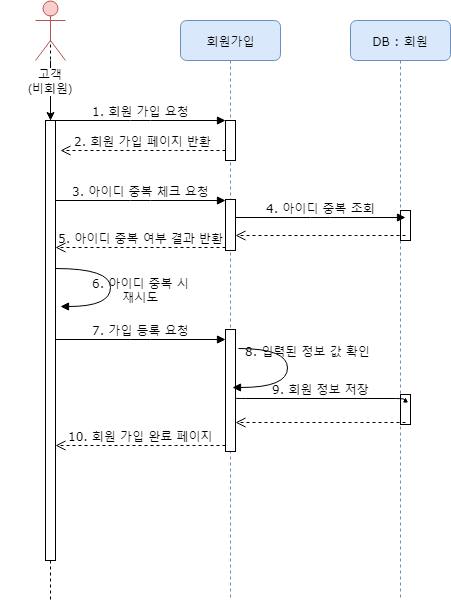

## 회원가입



### 아이디 중복 체크 요청

■ url

 `get : /users/check/id/{user_id}`

■ request

- path

  `user_id : 중복 확인하고 싶은 ID 값 `

■ response : 200

- 형식에 맞지 않는 id

  ```python
  {"result": "fail", "message": "id양식을 맞춰주세요", "data": None}
  ```

- 중복된 id

  ```python
  {"result": "fail", "message": "이미 사용하고 있는 id입니다.", "data": None}
  ```

- 사용할 수 있는 id

  ```python
  {"result": "success", "message": None, "data": "ok"}
  ```


### 가입 등록 요청

■ url

` post : /users/ `

■ request

- parameter : json

  ```json
  {
      "username": string,
      "user_id": string,
      "password": string,
      "email": string,
      "phone_number": string
  }
  ```

■ response : 200

- 실패

  ```json
  {
    "result": "fail",
    "message": "실패 이유",
    "data": null
  }
  ```

  

- 성공

  ```json
  {
    "result": "success",
    "message": null,
    "data": {
      "username": "user1",
      "user_id": "user31",
      "password": "pbkdf2_sha256$150000$NDRiWElD66Xg$SffhMdn5y960/88fxbPn6+Cfh21e6Ef/Pk6P3uDnm08=",
      "email": "user1@naver.com",
      "phone_number": "111111112"
    }
  }
  ```

  